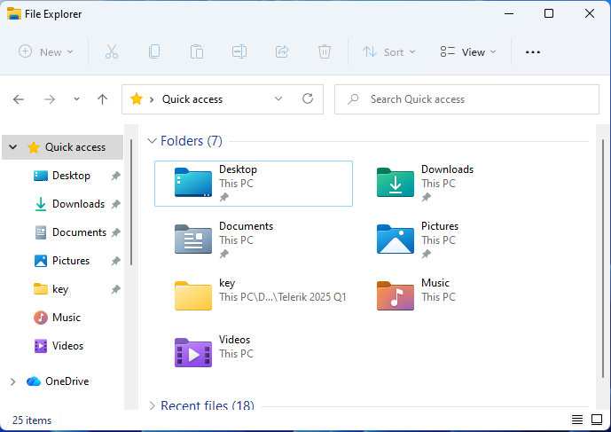

[English](README.md) | [繁體中文](README-HANT.md) | [简体中文](README-HANS.md)

# WinRoll RS

WinRoll RS 以 Rust 重新打造 WinRoll 2.0，適用於 Windows 10 和 Windows 11。

歡迎造訪 [WinRoll RS 網站](https://jedipi.github.io/WinRoll-RS/)，看看它的操作方式。

最新版本 v1.0.0 的直接下載連結：

- [可攜式版本 (ZIP, x64)](https://github.com/jedipi/WinRoll-RS/releases/download/v1.0.0/winroll-1.0.0-x64-portable.zip)
- [安裝程式 (EXE, x64)](https://github.com/jedipi/WinRoll-RS/releases/download/v1.0.0/winroll-1.0.0-x64-setup.exe)

WinRoll 能像捲起窗簾一樣，把視窗收起來，只留下標題列。它還提供幾項實用的視窗管理功能：視窗置頂、移至最底層、調整透明度，以及最小化至系統匣。

我希望延續原版 WinRoll 簡單直覺的操作體驗，並採用現代 Windows API，讓程式碼更容易維護。

## 背景

2000 年代初期，我非常喜歡一款叫做 WinRoll 的 Windows 小工具。

它的核心功能既簡單又實用：

> 在視窗標題列上按一下滑鼠右鍵，視窗就會捲起，只留下標題列。

原版 WinRoll 由 Wil Palma 開發，並於 2004 年推出 2.0 版。

這個專案後來停止開發。之後，FelixHuoEZ 將原始程式碼上傳至 GitHub：

https://github.com/FelixHuoEZ/winroll

原版幾乎全以 32 位元 x86 組合語言編寫，使用 MASM，針對的是年代久遠的 Windows 版本。

我重新打造這款工具，讓它適用於現代 Windows，同時保持小巧、不打擾日常操作的特色。

## 目標

我希望 WinRoll RS 能做到：

- 支援 Windows 10 x64
- 支援 Windows 11 x64
- 以輕量級工具的形式在背景執行
- 延續原版 WinRoll 的使用體驗
- 盡可能同時支援對 32 位元和 64 位元應用程式進行操作
- 正確處理現代 Windows 的 DPI 縮放
- 支援多螢幕環境
- 盡可能避免使用 DLL 注入
- 採用現代 Win32 API
- 將記憶體與 CPU 使用量維持在極低水準

本專案不支援 Windows XP、Vista、7、8，也不支援 32 位元 Windows。

## 核心功能

### 捲起 / 展開

在視窗標題列上按一下滑鼠右鍵，即可捲起視窗；再按一次即可還原。

一般視窗：

捲起後的視窗：

WinRoll 會記住視窗原本的大小與位置，讓視窗展開時能準確恢復原狀。

### 視窗置頂

在視窗的 **關閉 (X)** 按鈕上按一下滑鼠中鍵，即可開啟視窗置頂；再按一次
即可關閉。透過系統匣結束 WinRoll RS 時，凡是透過這個操作變更置頂狀態的視窗，
都會恢復原本的置頂設定。「暫停」和「全部展開」
不會影響視窗置頂狀態。

### 移至最底層

在視窗的 **關閉 (X)** 按鈕上按一下滑鼠右鍵，即可把視窗移到其他視窗後方，
而不會將它最小化，也不會改變它的大小或位置。

### 透明度

在標題列的空白處按一下滑鼠中鍵，即可套用設定好的透明度；再按一次，
即可恢復視窗原本的外觀。「暫停」會保留目前的外觀，
並停用這項滑鼠操作；「全部展開」不會影響透明度。

透明度設為 100% 時，視窗會完全隱形，也無法點擊。請從
WinRoll RS 系統匣選單選擇 **結束**，讓受影響的視窗在程式退出前恢復原狀。使用
逐像素分層算繪的應用程式不適用此功能。

### 最小化至系統匣

在視窗的 **最小化** 按鈕上按一下滑鼠中鍵，即可將視窗從桌面和工作列隱藏，
並依照「選項」中的設定，以以下方式收納：

- **以圖示顯示** (預設) 會為每個視窗建立一個通知區域圖示。按一下
  圖示即可還原視窗；如果找不到，請查看通知區域中的隱藏圖示。
- **以選單顯示** 會將視窗標題列在 WinRoll 系統匣選單的 **已最小化** 子選單中。
  按一下標題即可還原視窗。沒有任何視窗時，子選單會顯示 **(無)** 。

### 滑鼠操作

延續 WinRoll 經典的操作方式。

| 動作 | 滑鼠操作 |
|---|---|
| 捲起 / 展開 | 在標題列上按一下滑鼠右鍵 |
| 透明度 | 在標題列上按一下滑鼠中鍵 |
| 視窗置頂 | 在關閉按鈕上按一下滑鼠中鍵 |
| 移至最底層 | 在關閉按鈕上按一下滑鼠右鍵 |
| 最小化至系統匣 | 在最小化按鈕上按一下滑鼠中鍵 |

### 多語言支援

支援多種語言

如果你想新增語言或改善現有翻譯，請參閱 [貢獻翻譯](src/localization/README.md)。
每種語言都有獨立的原始碼檔案，並會一併編譯進執行檔。

### 檢查更新

WinRoll RS 會在啟動時靜默檢查新的穩定版本。在系統匣選單選擇 **檢查更新** 可手動檢查；
發現新版本時，選單會顯示 **有可用更新**。對話框會顯示可用版本或 **已是最新版本。**，
手動檢查支援重試與取消。選擇 **立即更新** 可下載相符的可攜式 ZIP 或安裝程式，
並查看進度、取消或重試。WinRoll 要求有效的 GitHub 資產 SHA-256 摘要，驗證下載後將其暫存於臨時目錄。
可攜式版本隨後會還原受管理的視窗，在原位置替換程式並自動重新啟動，保留偏好設定與啟動註冊。
還原失敗時，WinRoll 會繼續執行，列出受影響的視窗並提供**重試**；取消更新不會遺失仍需還原的視窗狀態。
安裝開始後無法關閉更新視窗。替換或啟動失敗時，會盡可能還原先前的程式並報告錯誤。
安裝版可以下載與驗證更新套件，但安裝程式交接功能仍在規劃中。

### 後續改進

其他規劃中的功能包括：

- 指定不套用功能的應用程式
- 可自行選擇是否啟用的動畫
- 可攜式設定
- 自動更新支援

## 不在開發範圍內的項目

WinRoll RS 定位為小巧的視窗工具，並不打算發展成完整的桌面視窗管理器，也不會取代以下工具或功能：

- Windows Snap
- PowerToys FancyZones
- 虛擬桌面管理器
- 平鋪式視窗管理器

本專案以經典的視窗捲起功能為核心，專注於提供簡單、實用的視窗管理操作。

## 原版 WinRoll

原版 WinRoll 的原始碼鏡像：

https://github.com/FelixHuoEZ/winroll

原版應用程式：WinRoll 2.0

著作權 © 2003–2004 Wil Palma。

原始專案採用寬鬆的授權條款，允許修改及再散布，但必須遵守以下條件：

1. 不得對原始軟體的來源作出不實陳述。
2. 修改過的版本必須清楚標示，讓人知道這是經過修改的版本。
3. 必須保留原始授權聲明。

WinRoll RS 是受 WinRoll 啟發、為現代環境重新打造的版本，並非原版 WinRoll 2.0。

## 致謝

感謝 Wil Palma 開發了原版 WinRoll。

習慣了捲起視窗的便利之後，就很難再捨棄這項功能。

也感謝 FelixHuoEZ 將 WinRoll 的原始程式碼保存在 GitHub 上。
